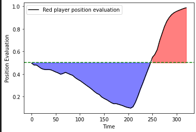
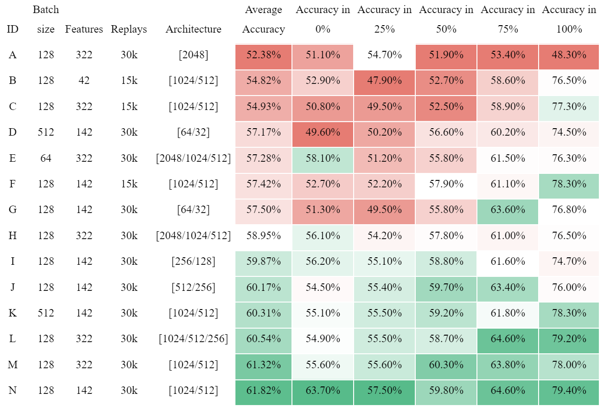

# SC2Eval
LSTM-based machine learning solution for evaluation of strategic position in Starcraft II.

The repo comes with one pre-trained model so you can evaluate your own matches, it also contains a few replays and their serialized versions for demo purposes. If you intend on training your own models using methods implemented within you need to gather a dataset of SC2 replays (I trained my models on 30 thousands). 

## Installation
The project uses python 3.10.2

After cloning you need to `pip install -r requirements.txt` and you're good to go

Training can be sped up using CUDA acceleration, [here's the official tensorflow's tutorial how](https://www.tensorflow.org/guide/gpu).

## How to serialize matches
Serialization (and vectorization) is required in order for the model to work. You can use any .SC2Replay file [(here's some info how to find your own replays)](https://liquipedia.net/starcraft2/Replay_Features#:~:text=Replays%20are%20saved%20and%20stored,in%20the%20user's%20Documents%20folder.)

You need to put your .SC2Replay files in `Replays/RawReplays` folder and then run `ProcessReplays()` function in `ReplaysParser.py` file. This will prepare your replays to be evaluated.

## How to evaluate a match
The `Code/SC2Eval.ipynb` Jupyter Notebook allows you to load up a model, and then in the last cell you can feed the model with serialized match of your choosing and it will generate a plot for you with the strategic position evaluation updated every five seconds of the match. 

  

## How accurate is that? 
The best one I could train so far amounts to around 62% correct winner predicition across the whole match and over 75% accuracy in the last 10% of the match.
From what I observed usually the dynamic (who is winning, who is losing) is correct, although the amplitude (how big is the advantage) is overexaggerated.
Here's the result of my experimentation with various architectures, features combinations and batch sizes.

  

## How can I train my own models?
The `Code/TrainModels.py` file has everything you need for that purpose. Once you build your own dataset composed of serialized replays, just put them in `SerializedReplays` folder, adjust your architecture choice in `TrainModels.py/InitializeLSTMModel()` and start the `IterateTraining()` method. Once your model is trained, you can evaluate its performance in `Code/SC2Eval.ipynb` in the 3rd code cell. The evaluation uses matches from `SerializedReplaysForValidation` folder, so you need a bunch in there too. It's important that matches used for validation were not part of the training set. 
